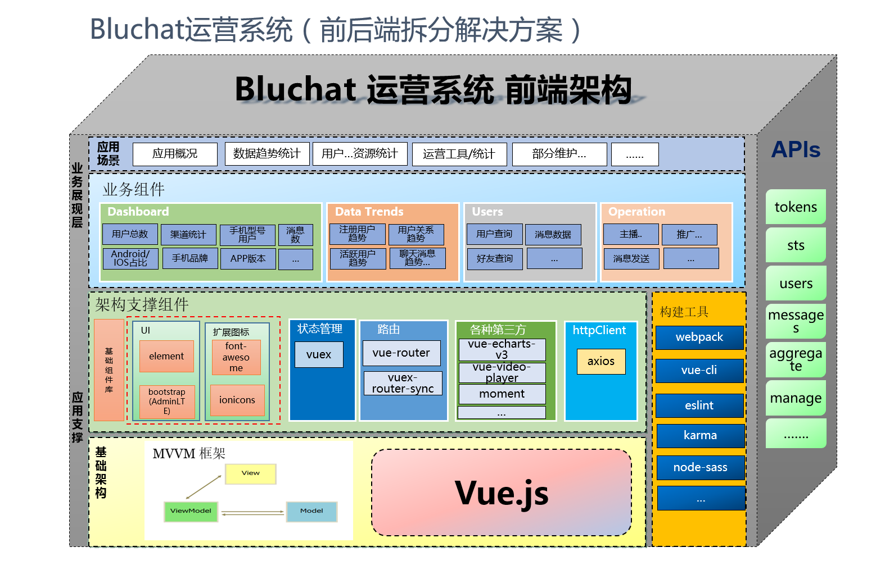

# DEMO

展示数据通过mock.js 构造

[Demo 地址](https://fantasykai.github.io/vue-admin-manager)

# vue-admin-manager

> 后端研发一枚，初创公司，目前没有web端开发，逐步需要做运维，运营的页面，想要快速开展工作，

> 就去了解了下目前比较火的，react 、vue 、angular，对比之后，感觉目前vue是最合适的，

> 去官网熟悉了一下，写了几个demo，就开始做这个后台，借鉴很多github上的优秀作品，自己也

> 输出一下，也方便自己回顾

# 简介

项目为SPA,前后端分离，前端使用vue-cli构建，认证使用JWT，后端数据库为mongodb，后端提供

restful接口，统计功能非常方便，在前端封装好aggregate,mapReduce，条件，

类似于前端组装好查询条件，后端直接吐对应的结果。

## 项目架构



## Build Setup

``` bash
# install dependencies
npm install

# serve with hot reload at localhost:8080
npm run dev

# 发布测试环境 包含 webpack ananalyzer
npm run build:sit-preview

# 构建生成环境
npm run build:prod

```

## 目录结构
```shell
├── build                      // 构建相关  
├── config                     // 配置相关
├── src                        // 源代码
│   ├── api                    // 所有请求
│   ├── assets                 // 主题 字体等静态资源
│   ├── components             // 全局公用组件（及页面）
│   ├── config                 // 配置项
│   ├── directive              // 全局指令
│   ├── filtres                // 全局filter
│   ├── mock                   // mock数据
│   ├── router                 // 路由
│   ├── store                  // 全局store管理
│   ├── styles                 // 全局样式
│   ├── utils                  // 全局公用方法
│   ├── App.vue                // 入口页面
│   └── main.js                // 入口 加载组件 初始化等
├── static                     // 第三方不打包资源
├── .babelrc                   // babel-loader 配置
├── .editorconfig              // 代码风格文件，前提是要你的编辑器支持
├── .gitignore                 // 用于Git配置不需要加入版本管理的文件
├── .postcssrc.js              // autoprefixer的配置文件
└── package.json               // 项目依赖管理

```

## 技术栈

- axios
- element-ui
- moment 日期处理
- vue2X、vue-router、vuex

### 工具集

- vue-core-image-upload
- vue-datasource
- vue-echarts-v3
- vue-quill-editor
- vue-simplemde
- vue-video-player

### UI方案

#### UI

- element-ui
- bootstrap(AdminLTE)

#### 扩展图标

- font-awesome
- ionicons

### TODO

- [x] 已完成 折叠导航栏

- [x] 已完成 登录获取用户昵称

- [x] 已完成 统计图标抽取

- [x] 已完成 接入阿里云OSS，STS(临时认证服务)

- [x] 已完成 支持视频播放

- [x]  vuex状态管理 （目前只记录了用户token信息）

- []  Dashboard中的echart图标，组件化重构 （第一次使用时，写的，代码比较冗余，后续拆成组件）

- []  404页面组件（目前空白），考虑使用自己博客上的腾讯公益

- []  401页面组件

- []  响应式，支持手机


### 备注

Dashboard 页面使用了vue-echarts-v3组件，是刚开始熟悉vue时，硬撸出来的，无美感可言啊。后面逐步熟悉及应用起来组件的思想才，

代码尚需逐步优化，哈哈


- [个人博客](https://fantasykai.cc)
